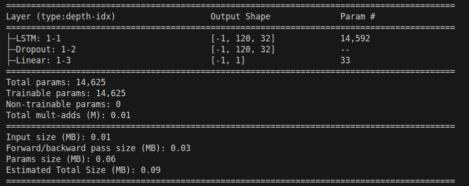
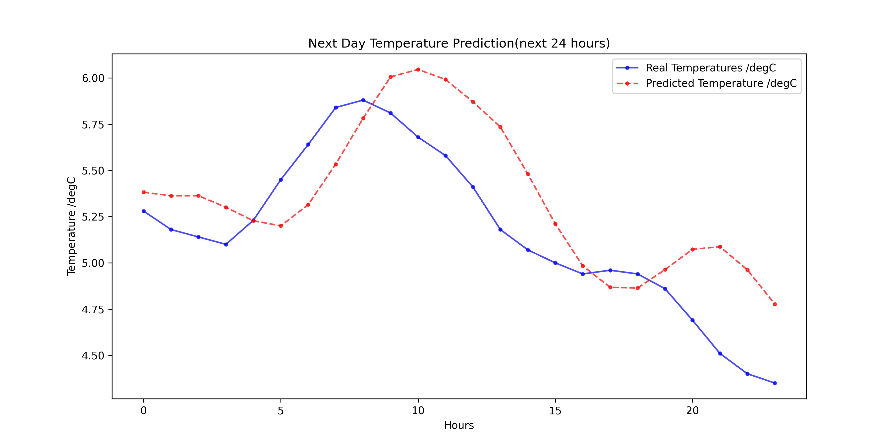
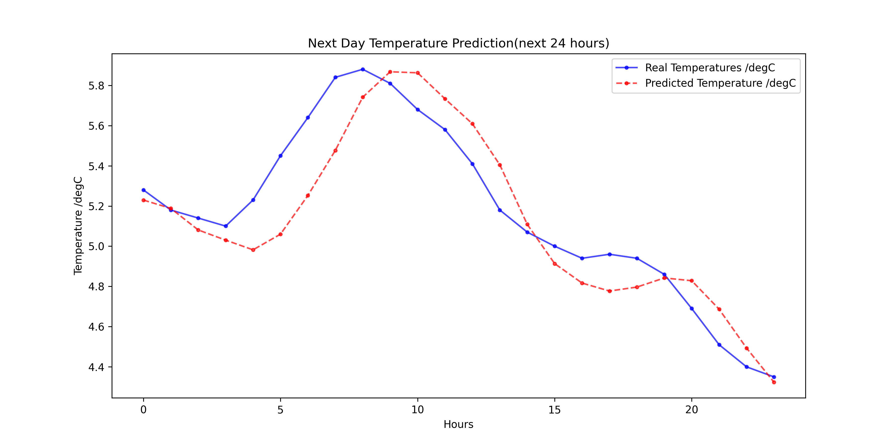
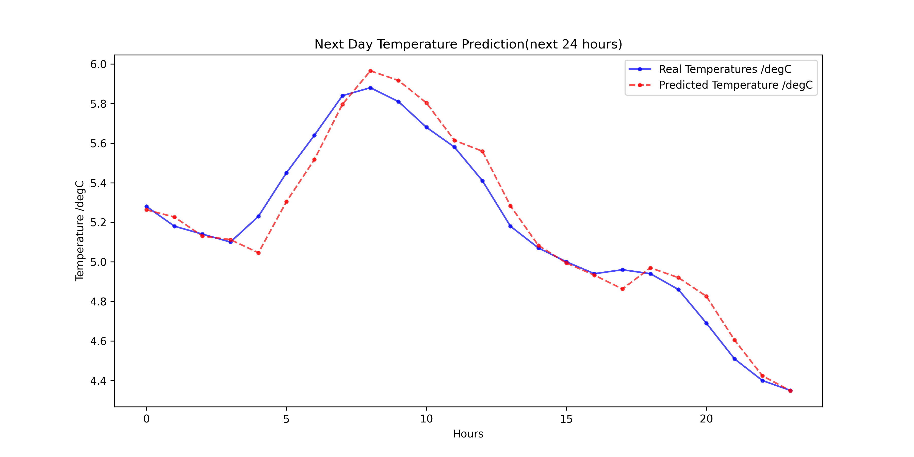
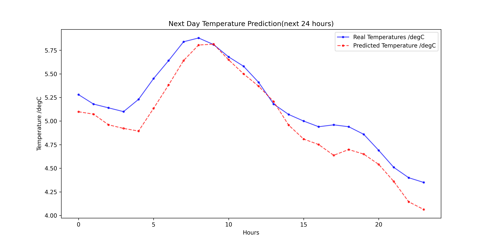
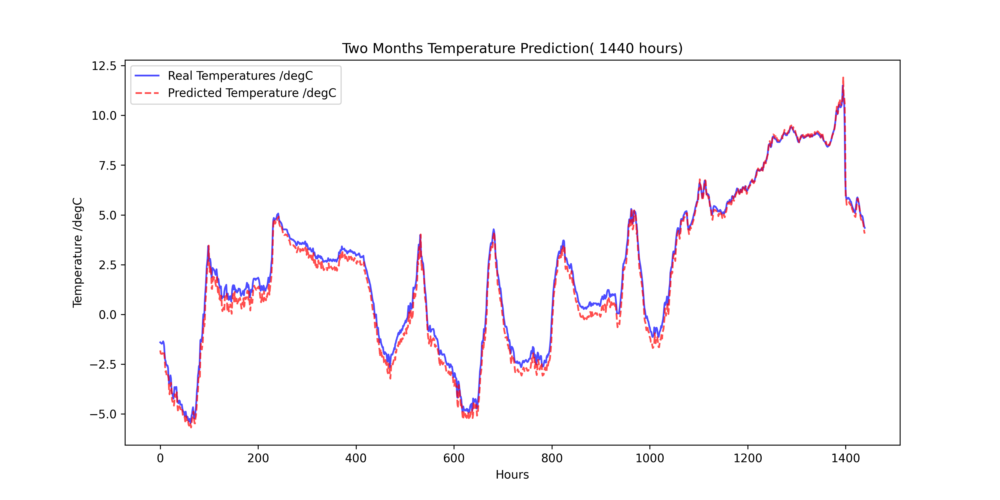

#  temperature-forecasting

## Target 
-  **the  target problem: predicting the temperature 24 hours in the future**

##  Project Overview
This project aims to develop a deep learning model using **Long Short-Term Memory (LSTM)** networks for weather forecasting. The model is trained on the **Jena Climate Dataset**, which contains weather data collected from the Max Planck Institute for Biogeochemistry in Jena, Germany.

##  Dataset Information
- **Source**: Max Planck Institute for Biogeochemistry
- **Location**: Weather Station, Jena, Germany
- **Time Frame Considered**: January 10, 2009 - December 31, 2016
- **Features**: The dataset consists of 14 weather-related features which recorded every **10 minutes**, including:
  (Temperature, Pressure, Humidity, Wind speed, Wind direction,...)

## Model Architectur
The weather forecasting model is built using **PyTorch** and is based on an **LSTM neural network** to capture temporal dependencies in time-series weather data.

## model summary

## Plotting Model Predictions for different training scheme 

.png  "plotting for five day/50_epochs")

